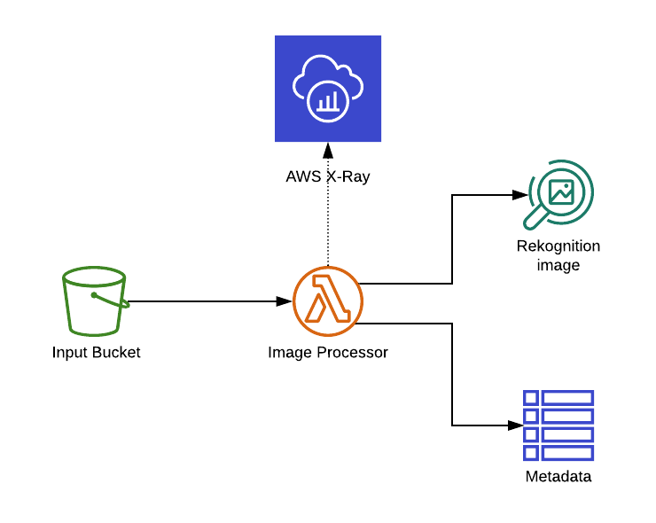

# CDK Image Analyzer Demo

This is a demo CDK application that's used to showcase some AWS services as well as a serverless processing workflow.

Things this demo shows

- AWS X-Ray
- S3 Event Notifications
- Amazon Rekognition
- boto3 clients vs. resources
- AWS CDK

## Architecture

## Deployment

1. Have the CDK and the AWS SDK installed
2. Configure your AWS credentials
3. Clone the repo
4. Nagivate to the repo
5. Create a new virtual environment: `python3 -m venv .env`
6. Activate the virtual environment: `source .env\bin\activate`
7. Install the dependencies: `pip install -r requirements.txt`
8. Deploy the CDK app: `cdk deploy`

## Opportunities for demonstration

### 1) What it does

1. Deploy the app (see instructions above)
2. Log in to the AWS Console and open the S3 Console
3. Locate the Input bucket, the name will be something like `cdk-image-analyzer-inputbucket...`
4. Upload an image to the input bucket
5. Navigate to DynamoDB and open the metadata table, it will be called something like `cdk-image-analyzer-metadatatable...`
6. You should see a single item in the table, click on it an show the labels that have been generated by Rekognition.

### 2) How it works

1. Open the lambda function in the lambda console, it will be called something like `cdk-image-analyzer-processinglambda...`
2. Point out the event handler and explain, how data is extracted from the S3 event.
3. Point out the different ways boto3 is used - Rekognition Client and Table Resource
4. Note the import of the X-Ray SDK and the `patch_all()` method
5. Now upload another image and show the result in DynamoDB
6. Open CloudWatch logs and take a look at the logs of the lambda function, point out the response from Rekognition

### 3) X-Ray

1. After you've done 1) and 2), there should be some traces in AWS X-Ray
2. Open the X-Ray service and click on the service map
3. Wait a couple of seconds, it's not that fast on first load
